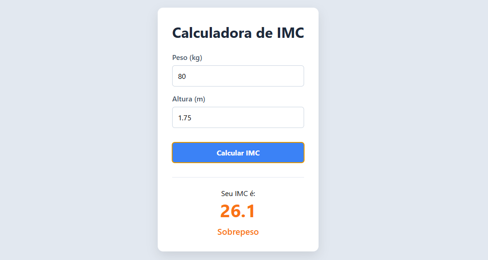

# ⚖️ Calculadora de IMC | ReactJS


---

## 📌 Sobre o Projeto

A **Calculadora de IMC** é uma aplicação desenvolvida em **ReactJS** com foco em praticar conceitos fundamentais do ecossistema React, como gerenciamento de estado, manipulação de eventos e renderização dinâmica.

O usuário informa seu peso e altura, e o sistema realiza automaticamente o cálculo do **Índice de Massa Corporal (IMC)**, exibindo:

- O valor calculado do IMC
- A classificação correspondente
- Feedback visual dinâmico com alteração de cores conforme o resultado

Projeto criado com foco em evolução prática no desenvolvimento Front-End.

---

## 🎯 Funcionalidades

✔️ Cálculo automático do IMC  
✔️ Classificação do resultado  
✔️ Interface responsiva  
✔️ Feedback visual dinâmico  
✔️ Validação básica dos campos  
✔️ Atualização instantânea da interface com React Hooks  

---

## 🧠 Conceitos Aplicados

Durante o desenvolvimento deste projeto, foram utilizados conceitos importantes do ReactJS:

### ⚛️ useState
Gerenciamento de estado para armazenar dados dos inputs e resultados do cálculo.

### 🎛️ Componentes Controlados
Sincronização entre os inputs e o estado da aplicação utilizando `onChange`.

### 🖱️ Manipulação de Eventos
Tratamento do envio do formulário com `onSubmit` e uso do `preventDefault()`.

### 🔄 Renderização Condicional
Exibição dinâmica da área de resultados somente após o cálculo.

### 🎨 Estilização Dinâmica
Alteração visual baseada na classificação do IMC utilizando estilos condicionais.

---

## 🚀 Tecnologias Utilizadas

- ReactJS
- JavaScript
- HTML5
- CSS3

---

## 📸 Preview do Projeto

Adicione aqui uma imagem ou GIF do projeto funcionando.

```md

```

---

## ⚙️ Como Executar o Projeto

### 1️⃣ Clone o repositório

```bash
git clone https://github.com/SEU-USUARIO/projeto-calculadora-imc.git
```

### 2️⃣ Acesse a pasta do projeto

```bash
cd projeto-calculadora-imc
```

### 3️⃣ Instale as dependências

```bash
npm install
```

### 4️⃣ Execute o projeto

```bash
npm run dev
```

---

## 📂 Estrutura do Projeto

```bash
📦 calculadora-imc
 ┣ 📂 src
 ┃ ┣ 📂 components
 ┃ ┣ 📂 assets
 ┃ ┣ 📜 App.jsx
 ┃ ┗ 📜 main.jsx
 ┣ 📜 package.json
 ┗ 📜 README.md
```

---

## 👨‍💻 Autor

### Gabriel Henrique Rocha

Desenvolvedor Front-End em formação, focado em criar interfaces modernas, responsivas e funcionais.

- 💼 LinkedIn: https://www.linkedin.com/in/gabriel-h-rocha/
- 💻 GitHub: https://github.com/Gabriel-H-Alves

---

## ⭐ Contribuição

Sinta-se à vontade para abrir issues, sugestões ou melhorias para o projeto.

---

## 📄 Licença

Este projeto está sob a licença MIT.